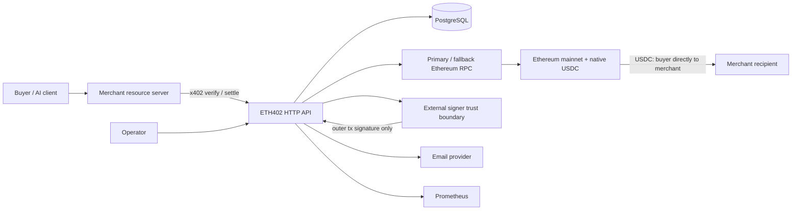

# Architecture

ETH402 is a modular monolith. One deployable Go process owns HTTP routing,
merchant policy, protocol orchestration, persistence, and workers; PostgreSQL
is the durable coordination boundary. Caddy terminates public TLS. Ethereum
JSON-RPC and email delivery are replaceable adapters. There are no custom
contracts or custodial ledgers.

## Components and trust boundaries

- `internal/httpapi`: untrusted HTTP boundary, request limits, errors, health.
  Rate limits key on the client address resolved from the direct peer, or from
  `X-Forwarded-For` when the peer is a configured trusted proxy.
- `internal/config`: environment parsing and mainnet/USDC production invariants.
- `internal/store` and migrations: durable truth and concurrency enforcement.
- `internal/x402` and `verification`: deterministic identity plus the narrow
  v2/EIP-3009 verifier, built on the pinned official x402 Go implementation.
- `internal/settlement`: state rules, `/settle` admission, the broadcast
  pipeline shared by HTTP and workers, and confirmation.
- `internal/ethereum`: bounded health reads, read-only verification calls,
  primary/fallback RPC reads, and the single-attempt broadcast path (a failed
  send is ambiguous, so it never rotates providers).
- `internal/signer`: transaction-signing boundary. Raw keys are development-only.
- `internal/email`, `walletproof`, `auth`, `merchant`: onboarding boundary.
  Production email delivery is provider-neutral SMTP with mandatory
  certificate-verified TLS; development logging/file delivery cannot be
  selected in production.
- `GET /merchant` and `/merchant/api/*`: self-contained merchant administration.
  Email creates a short-lived hashed session; a fresh recipient-wallet proof
  elevates that session before key management or private statistics are exposed.
  The browser session is separate from integration API keys and from x402.
- `internal/retention`: privacy lifecycle, separate from x402 verification and
  settlement. It expires stale verifications, tombstones only safely terminal
  authorizations, and prunes ephemeral onboarding credentials in bounded
  batches.
- workers: database-leased/idempotent confirmation and recovery loops.

RPC data is untrusted until cross-checked and confirmed. Email proves mailbox
control, not business legitimacy. API keys authenticate merchant API calls, not
x402 buyer authorizations. Metrics and public stats are separate disclosure
boundaries: `/stats` is a versioned public schema, while `/metrics` is gated by
configuration and withheld at the proxy.

## Failure recovery

Every payment has a deterministic structured identity and a unique database
row. Authorization nonce uniqueness provides final replay enforcement. Writers
for one authorization serialise on an advisory transaction lock before
inserting, because a duplicate violates the identity and nonce uniqueness
constraints simultaneously and concurrent inserts would otherwise deadlock
rather than converge.
Milestone 2 creates payment rows only after successful verification, so a
malformed signature cannot reserve/poison a buyer nonce in PostgreSQL.
Verification attempts remain append-only, including malformed outer requests.
Settlement intent is committed before signing/broadcast. Workers claim durable
rows with transactional locking; repeated execution checks current state.
Admission first locks the payment, then the currently active merchant row.
The second lock serialises the per-merchant settlement quota across different
payments and makes a completed suspension revoke later settlement requests.

An ambiguous broadcast records signed-transaction identity and is reconciled
by the recovery worker: on-chain lookup first, then — after a grace window and
only from the stored nonce, gas, and fee fields — an identical re-broadcast
whose deterministic sighash must match the stored one. Receipt observations record
block hash/number; finalization requires canonical confirmations. Reorgs
return non-final transactions to broadcast. Replacement uses the same Ethereum
account nonce, is linked explicitly, bumps fees within the configured ceiling,
and never changes USDC calldata; whichever version mines becomes the recorded
truth. A nonce-gap filler is not eligible until the EIP-3009 authorization has
been expired for a full safety margin, and its exact signed bytes are committed
before broadcast so an ambiguous send is retried identically. Process or
database restart resumes from durable states.

See [settlement flow](SETTLEMENT_FLOW.md), [data model](DATA_MODEL.md), and
[ADR-0001](decisions/0001-modular-monolith-and-scope.md).
