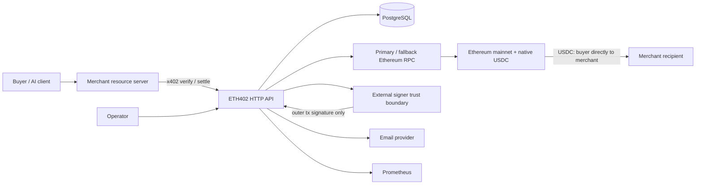

# Architecture

ETH402 is a modular monolith. One deployable Go process owns HTTP routing,
merchant policy, protocol orchestration, persistence, and workers; PostgreSQL
is the durable coordination boundary. Caddy terminates public TLS. Ethereum
JSON-RPC and email delivery are replaceable adapters. There are no custom
contracts or custodial ledgers.

## Components and trust boundaries

- `internal/httpapi`: untrusted HTTP boundary, request limits, errors, health.
- `internal/config`: environment parsing and mainnet/USDC production invariants.
- `internal/store` and migrations: durable truth and concurrency enforcement.
- `internal/x402` and `verification`: deterministic identity plus the narrow
  v2/EIP-3009 verifier, built on the pinned official x402 Go implementation.
- `internal/settlement`: explicit state rules; live settlement remains future.
- `internal/ethereum`: bounded health reads, read-only verification calls,
  primary/fallback RPC, and a future non-blind broadcast path.
- `internal/signer`: transaction-signing boundary. Raw keys are development-only.
- `internal/email`, `walletproof`, `auth`, `merchant`: onboarding boundary.
- workers: database-leased/idempotent confirmation and recovery loops.

RPC data is untrusted until cross-checked and confirmed. Email proves mailbox
control, not business legitimacy. API keys authenticate merchant API calls, not
x402 buyer authorizations. Metrics and public stats are separate disclosure
boundaries.

## Failure recovery

Every payment has a deterministic structured identity and a unique database
row. Authorization nonce uniqueness provides final replay enforcement.
Milestone 2 creates payment rows only after successful verification, so a
malformed signature cannot reserve/poison a buyer nonce in PostgreSQL.
Verification attempts remain append-only, including malformed outer requests.
Settlement intent is committed before signing/broadcast. Workers claim durable
rows with transactional locking; repeated execution checks current state.

An ambiguous broadcast records signed-transaction identity and enters manual
reconciliation rather than sending a new transaction. Receipt observations
record block hash/number; finalization requires canonical confirmations.
Reorgs return non-final transactions to confirmation. Replacement uses the
same Ethereum account nonce, is linked explicitly, and never changes USDC
calldata. Process or database restart resumes from durable states.

See [settlement flow](SETTLEMENT_FLOW.md), [data model](DATA_MODEL.md), and
[ADR-0001](decisions/0001-modular-monolith-and-scope.md).
