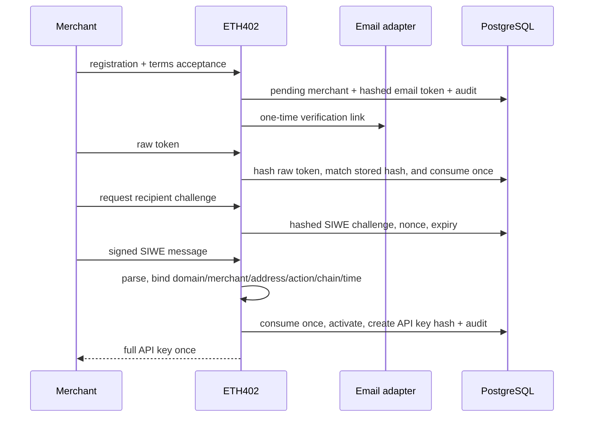

# Registration flow

Email responses are enumeration-resistant. Resends and registrations are
throttled. Disposable/free-provider and domain lists are operator controls,
not proof of legitimacy. A determined actor can create multiple accounts.

Recipient changes require API-key authentication, a fresh challenge for the
new address, policy cooldown, append-only history, and an audit event.
