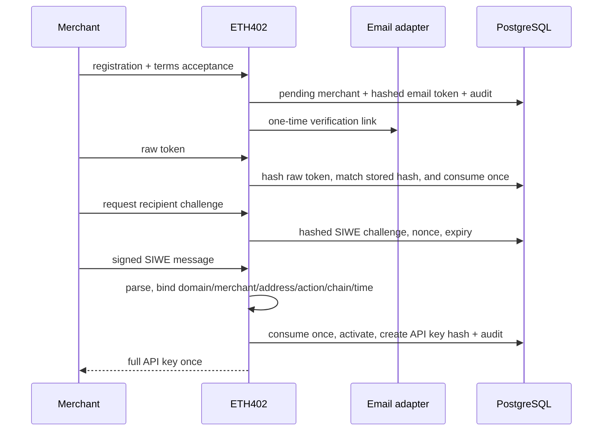

# Registration flow

The browser flow continues at `/merchant`. Consuming the emailed token also
creates an unprivileged admin-session cookie. The initial recipient signature
activates the merchant and elevates that session. Later email sign-ins require a
fresh `authenticate-admin` recipient signature before the panel may show private
statistics or manage API keys. See [ADR-0005](decisions/0005-merchant-admin-sessions-and-private-stats.md).

Email responses are enumeration-resistant. Resends and registrations are
throttled. Disposable/free-provider and domain lists are operator controls,
not proof of legitimacy. A determined actor can create multiple accounts.

Recipient changes require API-key authentication, a fresh challenge for the
new address, policy cooldown, append-only history, and an audit event. The
cooldown is measured from the most recent verified recipient proof in
`recipient_address_history`, so unrelated merchant writes such as operator
suspension and reinstatement neither extend nor reset it.

See the [public integration guide](INTEGRATION.md) for request examples and the
versioned [OpenAPI contract](../openapi/eth402.yaml) for exact schemas.
