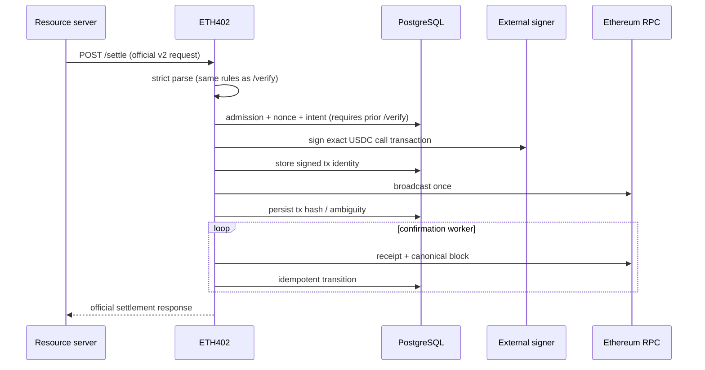

# Settlement flow

Milestone 2 implements the verification portion through `/verify`. It performs
strict scope checks, checks USDC `authorizationState`, verifies the EIP-712
signature with the pinned official SDK, and simulates
`transferWithAuthorization`. It never signs or broadcasts a transaction.
Milestone 3 implements settlement as shown below; the Cloud KMS signer backend
and ambiguous-broadcast recovery remain open on the milestone checklist.

`/settle` requires a prior successful `/verify` for the same payment: admission
reads the durable payment record, which is what binds the recipient to an
active registered merchant (ADR-0004 decision 9). This is a deliberate
divergence from the reference facilitator, which verifies and settles in one
call. The intent step commits first: one transaction locks the payment row,
applies admission, persists the payer signature the payment identity binds,
allocates the nonce, moves the payment to `broadcasting`, and writes the
`intent` transaction row; nonce allocation deliberately comes last so a refused
request cannot consume a nonce and gap the sequence. Refusals are committed as
`settlement_attempts` rows with a stable reason code.

Broadcast is synchronous-attempt, asynchronous-fallback. `/settle` claims the
payment lease and runs the pipeline inline — build the
`transferWithAuthorization` calldata from the durable record, sign under
`ETH402_SIGNING_TIMEOUT`, record the signed-transaction hash, broadcast once
against the primary RPC, record the transaction hash — and returns the official
`SettleResponse` with the hash. A duplicate call for an already-broadcast
payment returns the recorded hash. If the inline attempt cannot finish (signer
or RPC failure), the durable intent remains and the broadcast worker retries it
on `ETH402_WORKER_INTERVAL`; a send whose outcome is unknown becomes
`ambiguous` and moves the payment to `manual_review` for recovery, never a
re-sign or a fresh nonce (ADR-0004 decision 4). An intent whose authorization
expires before broadcast is retired as `expired` with its transaction `dropped`
rather than buying a predictable revert (decision 11).

The confirmation worker leases payments in `broadcast`/`confirming`, reads the
receipt, and finalizes at `ETH402_REQUIRED_CONFIRMATIONS` (default 12)
canonical confirmations; a `status=0` receipt becomes `reverted`. Gas fields on
the transaction come from configuration verbatim — the configured ceilings are
the spend, so settlement cost never depends on chain fee conditions.

Valid states and edges are encoded in `internal/settlement/state.go`. Confirmed
and failed states are terminal. Ambiguous RPC results require hash/nonce
reconciliation (recovery remains unimplemented). A duplicate request
returns/converges on the existing payment; unique structured identity and
`(network, asset, payer, authorization_nonce)` constraints are final
enforcement.

The facilitator signer signs the outer Ethereum transaction and pays gas. It
does not sign buyer authorization and never holds USDC. Merchant-specific
signers are not required. The available backends are the disabled default and
the development key signer for local use; `external` is reserved for Cloud KMS
and rejected at startup until that backend lands.
