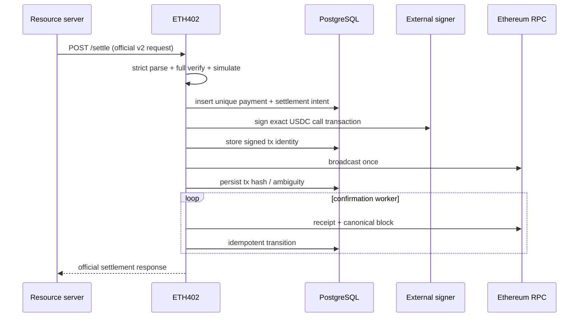

# Settlement flow

Milestone 2 implements the verification portion through `/verify`. It performs
strict scope checks, checks USDC `authorizationState`, verifies the EIP-712
signature with the pinned official SDK, and simulates
`transferWithAuthorization`. It never signs or broadcasts a transaction.
Milestone 3 will implement the settlement portion shown below.

The intent step is implemented. One transaction locks the payment row, applies
admission, allocates the nonce, moves the payment to `broadcasting`, and writes
the `intent` transaction row; nonce allocation deliberately comes last so a
refused request cannot consume a nonce and gap the sequence. Admission requires
a verified payment whose recipient is an active registered merchant and whose
`valid_before` sits outside the configured margin. Refusals are committed as
`settlement_attempts` rows with a stable reason code. Signing, broadcast, and
the confirmation worker remain unimplemented, and the signer is still disabled.

Valid states and edges are encoded in `internal/settlement/state.go`. Confirmed
and failed states are terminal. Ambiguous RPC results require hash/nonce
reconciliation. A duplicate request returns/converges on the existing payment;
unique structured identity and `(network, asset, payer, authorization_nonce)`
constraints are final enforcement.

The facilitator signer signs the outer Ethereum transaction and pays gas. It
does not sign buyer authorization and never holds USDC. Merchant-specific
signers are not required.
