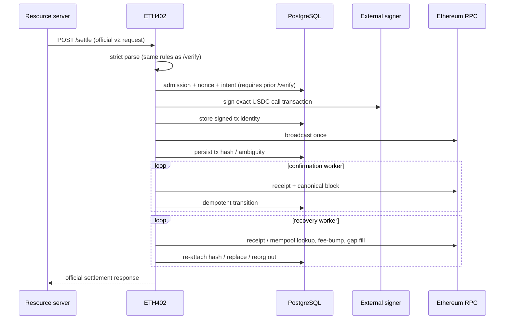

# Settlement flow

Milestone 2 implements the verification portion through `/verify`. It performs
strict scope checks, checks USDC `authorizationState`, verifies the EIP-712
signature with the pinned official SDK, and simulates
`transferWithAuthorization`. It never signs or broadcasts a transaction.
Milestone 3 implements settlement as shown below; the Cloud KMS signer backend
remains the only open item on the milestone checklist.

`/settle` requires a prior successful `/verify` for the same payment: admission
reads the durable payment record, which is what binds the recipient to an
active registered merchant (ADR-0004 decision 9). This is a deliberate
divergence from the reference facilitator, which verifies and settles in one
call. The intent step commits first: one transaction locks the payment row,
applies admission, persists the payer signature the payment identity binds,
allocates the nonce, moves the payment to `broadcasting`, and writes the
`intent` transaction row; nonce allocation deliberately comes last so a refused
request cannot consume a nonce and gap the sequence. Refusals are committed as
`settlement_attempts` rows with a stable reason code.

Broadcast is synchronous-attempt, asynchronous-fallback. `/settle` claims the
payment lease and runs the pipeline inline — build the
`transferWithAuthorization` calldata from the durable record, sign under
`ETH402_SIGNING_TIMEOUT`, record the signed-transaction hash, broadcast once
against the primary RPC, record the transaction hash — and returns the official
`SettleResponse` with the hash. A duplicate call for an already-broadcast
payment returns the recorded hash. If the inline attempt cannot finish (signer
or RPC failure), the durable intent remains and the broadcast worker retries it
on `ETH402_WORKER_INTERVAL`; a send whose outcome is unknown becomes
`ambiguous` and moves the payment to `manual_review` for recovery, never a
re-sign or a fresh nonce (ADR-0004 decision 4). An intent whose authorization
expires before broadcast is retired as `expired` with its transaction `dropped`
rather than buying a predictable revert (decision 11).

The confirmation worker leases payments in `broadcast`/`confirming`/`replaced`,
reads the receipt, and finalizes at `ETH402_REQUIRED_CONFIRMATIONS` (default
12) canonical confirmations; a `status=0` receipt becomes `reverted`. A
transaction previously seen mined whose receipt disappears from the canonical
chain was reorged out: it returns to `broadcast` and is observed from scratch.

Gas fields are estimated, not copied from configuration: the initial max fee is
`min(2·baseFee + tip, ETH402_MAX_FEE_PER_GAS_WEI)` against the latest block,
with `ETH402_MAX_PRIORITY_FEE_PER_GAS_WEI` as the tip. The configured values
remain the hard spend ceiling and the gas limit — estimation only avoids
overpaying beneath the ceiling and leaves headroom for replacement bumps. The
persisted gas limit and fee pair are what recovery may ever re-sign.

The recovery worker resolves what the broadcast and confirmation pipelines
cannot (ADR-0004 decision 4). An `ambiguous` transaction is first reconciled
on chain — the signed transaction's keccak is its transaction hash, so a
receipt or mempool sighting re-attaches the hash and returns the payment to
the broadcast pipeline. Only after `ETH402_SETTLEMENT_RECOVERY_GRACE` (default
2m) without a sighting may the identical transaction be re-signed from the
stored nonce, gas, and fee fields and re-broadcast; the recomputed hash must
equal the stored one, otherwise the record is treated as corrupt and left in
`manual_review`. Rows written before migration `000004` lack the stored fee
fields and are resolved by on-chain lookup only. A broadcast still pending
after `ETH402_SETTLEMENT_REPLACEMENT_AFTER` (default 5m) is replaced by a
fee-bumped transaction on the same nonce (tip ×1.125, ceiling-capped); when
the ceiling leaves no headroom the transaction is left pending for an operator
decision. If the network mines the original instead, recovery records the
original as the truth and drops the never-minable replacement. A `dropped`
nonce blocking a later in-flight nonce of the same signer is filled by
re-broadcasting the original expired intent, whose predictable revert consumes
the nonce. Recovery never finalizes a payment itself — it re-attaches hashes
or returns transactions to the broadcast pipeline, and the confirmation worker
observes them from there.

Valid states and edges are encoded in `internal/settlement/state.go`. Confirmed
and failed states are terminal. A duplicate request returns/converges on the
existing payment; unique structured identity and
`(network, asset, payer, authorization_nonce)` constraints are final
enforcement.

The facilitator signer signs the outer Ethereum transaction and pays gas. It
does not sign buyer authorization and never holds USDC. Merchant-specific
signers are not required. The available backends are the disabled default and
the development key signer for local use; `external` is reserved for Cloud KMS
and rejected at startup until that backend lands.
