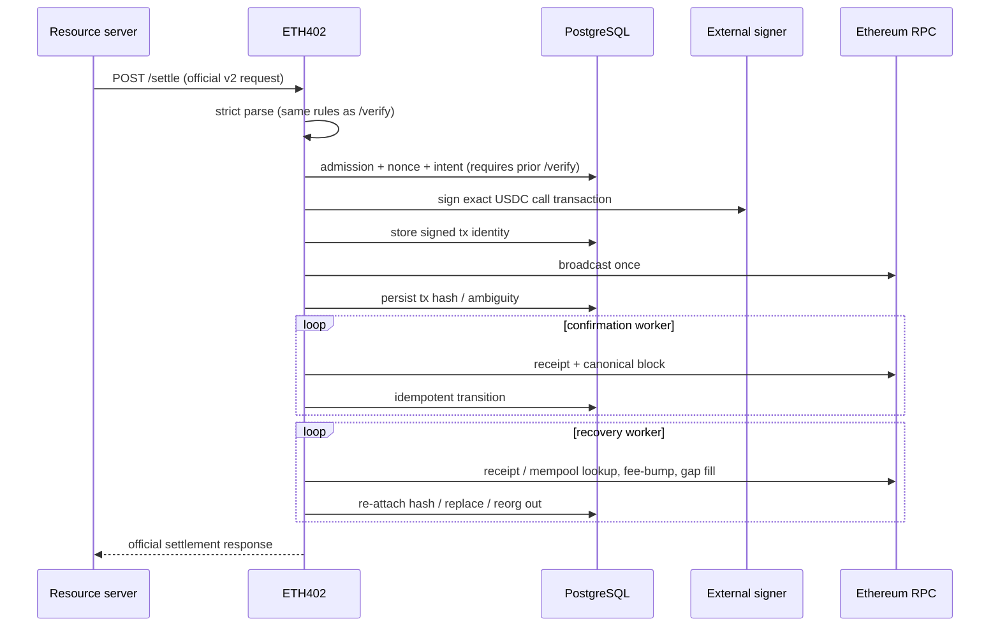

# Settlement flow

Milestone 2 implements the verification portion through `/verify`. It performs
strict scope checks, checks USDC `authorizationState`, verifies the EIP-712
signature with the pinned official SDK, and simulates
`transferWithAuthorization`. It never signs or broadcasts a transaction.
Milestone 3 implements settlement as shown below, including the Cloud KMS
signer backend.

`/settle` requires a prior successful `/verify` for the same payment: admission
reads the durable payment record, which is what binds the recipient to an
active registered merchant (ADR-0004 decision 9). This is a deliberate
divergence from the reference facilitator, which verifies and settles in one
call. The intent step commits first: one transaction locks the payment row,
then locks and re-checks the active merchant row before applying the
merchant-scoped quota. The merchant lock makes concurrent payments decide in
commit order and makes suspension effective even for payments attributed during
an earlier `/verify`. The transaction then persists the payer signature the
payment identity binds, allocates the nonce, moves the payment to `broadcasting`,
and writes the `intent` transaction row; nonce allocation deliberately comes
last so a refused request cannot consume a nonce and gap the sequence. Refusals
are committed as `settlement_attempts` rows with a stable reason code.

Every broadcast is simulated first. The exact calldata that would be sent is run
through `eth_call` from the signer address, so what is checked is literally what
would be broadcast. `/verify` already read `authorizationState`, but a nonce
consumed between `/verify` and `/settle` — the conflicting-facilitators race —
would otherwise be discovered by spending gas on a certain revert and by handing
the caller a transaction hash for a doomed transfer. A revert retires the intent
as `failed` with its transaction `dropped`, unbroadcast and unsigned. If the
allocated nonce later blocks another, recovery fills it only after `validBefore`
plus the full safety margin has passed, so the authorization cannot become a
delayed transfer. A
simulation that cannot *run* is transient and leaves the committed intent for the
next tick, because abandoning a payment over a rate-limited RPC would lose one
that could have settled.

Broadcast is synchronous-attempt, asynchronous-fallback. `/settle` claims the
payment lease and runs the pipeline inline — build the
`transferWithAuthorization` calldata from the durable record, sign under
`ETH402_SIGNING_TIMEOUT`, record the signed-transaction hash, broadcast once
against the primary RPC, require its returned hash to equal the locally derived
keccak of the signed bytes, record that local hash — and returns the official
`SettleResponse` with the hash. A mismatched acknowledgement is treated like an
unknown send outcome and reconciled under the local hash rather than allowing
provider-controlled identity into durable state. A duplicate call for an already-broadcast
payment returns the recorded hash, including after it becomes terminally
`confirmed` or `reverted`. If the inline attempt cannot finish (signer
or RPC failure), the durable intent remains and the broadcast worker retries it
on `ETH402_WORKER_INTERVAL`; a send whose outcome is unknown becomes
`ambiguous` and moves the payment to `manual_review` for recovery — never a
fresh nonce, and any re-sign is of the identical transaction only (ADR-0004
decision 4). An intent whose authorization
expires before broadcast is retired as `expired` with its transaction `dropped`
rather than buying a predictable revert (decision 11).

The confirmation worker leases payments in `broadcast`/`confirming`/`replaced`,
reads the receipt, binds its transaction hash to the requested transaction and
its block identity to the requested canonical block, and finalizes at
`ETH402_REQUIRED_CONFIRMATIONS` (default 12) canonical confirmations. Only
receipt status `0` or `1` is accepted; successful and `status=0` receipts pass the same
canonical-hash and depth checks before becoming terminal. A
transaction previously seen mined whose receipt disappears from the canonical
chain was reorged out: it returns to `broadcast` and is observed from scratch.

A payer's signature is accepted in either recovery-id encoding. The official
verifier applies `v - 27` before recovery, so it accepts 0/1 as well as 27/28,
while `ecrecover` on chain requires 27/28 — calldata construction therefore
normalizes 0/1 upward. Before that, a payment signed with the 0/1 form, which
`crypto.Sign` and many wallet libraries emit, verified successfully and then could
not settle. Normalizing at calldata time rather than at verification keeps the
payment identity intact, since the identity hash binds the signature exactly as the
payer sent it.

Gas fields are estimated, not copied from configuration: the initial max fee is
`min(2·baseFee + tip, ETH402_MAX_FEE_PER_GAS_WEI)` against the latest block,
with `ETH402_MAX_PRIORITY_FEE_PER_GAS_WEI` as the tip. The configured values
remain the hard spend ceiling and the gas limit — estimation only avoids
overpaying beneath the ceiling and leaves headroom for replacement bumps. The
persisted gas limit and fee pair are what recovery may ever re-sign.

The recovery worker resolves what the broadcast and confirmation pipelines
cannot (ADR-0004 decision 4). An `ambiguous` transaction is first reconciled
on chain — the signed transaction's keccak is its transaction hash, so a
receipt or mempool sighting re-attaches the hash and returns the payment to
the broadcast pipeline. Only after `ETH402_SETTLEMENT_RECOVERY_GRACE` (default
2m) without a sighting may the identical transaction be re-signed from the
stored nonce, gas, and fee fields and re-broadcast. Identity is proven by the
stored **sighash** — the deterministic digest every signature of the same
transaction commits to — because Cloud KMS randomizes the ECDSA nonce and
never reproduces the raw bytes. When the re-signed hash differs, the fresh
signature is recorded replacement-shaped: the ambiguous row becomes `replaced`
under its derived hash, the re-signed row becomes the active broadcast, the
payment moves `manual_review → replaced`, and the network mining either
signature resolves the payment through the ordinary replacement machinery. A
sighash mismatch means the record is corrupt and the payment stays in
`manual_review`. Rows written before migration `000006` have no stored sighash
and fall back to the raw-hash comparison, which only a deterministic signer
satisfies; rows before `000004` lack the stored fee fields and are resolved by
on-chain lookup only. Failed re-broadcasts are counted on the transaction row
(migration `000010`) and the wait doubles per attempt, capped at 32× the grace
window — each re-sign is a paid KMS operation, so an unbounded per-tick retry
would be continuous KMS spend against a provider that may never answer. A
broadcast still pending
after `ETH402_SETTLEMENT_REPLACEMENT_AFTER` (default 5m) is replaced by a
fee-bumped transaction on the same nonce (tip ×1.125, with both the fee cap
and the tip raised to the mempool's 110% price-bump floor so the node actually
accepts the replacement, ceiling-capped); when
the ceiling leaves no headroom the transaction is left pending for an operator
decision. If the network mines the original instead, recovery records the
original as the truth and drops the never-minable replacement — a reverted
original only once it has cleared the same confirmation depth as a success, so
a reorg cannot resurrect a payment already marked reverted. A `dropped`
nonce blocking a later in-flight nonce of the same signer is filled only after
the authorization has been expired for a full safety margin, whether the payment
was retired as `expired` or `failed`. Its exact signed bytes are persisted before
broadcast and reused after an ambiguous send; the predictable revert consumes
the nonce without reviving the payment. A filler stuck pending past the
replacement window is fee-bumped on the same nonce like any other stuck
broadcast, and both signatures stay watched until one lands. A filler the chain
*accepts* is an anomaly — USDC moved on an
authorization judged expired, so the record disagrees with the ledger — and is
escalated once to `manual_review` with its receipt for a human to reconcile,
which is the only edge out of `expired`. Recovery never finalizes a payment itself — it re-attaches hashes
or returns transactions to the broadcast pipeline, and the confirmation worker
observes them from there.

Valid states and edges are encoded in `internal/settlement/state.go`. Confirmed
and failed states are terminal. A duplicate request returns/converges on the
existing payment; unique structured identity and
`(network, asset, payer, authorization_nonce)` constraints are final
enforcement.

The facilitator signer signs the outer Ethereum transaction and pays gas. It
does not sign buyer authorization and never holds USDC. Merchant-specific
signers are not required. Production is designed for the KMS-fronted policy
signer (`ETH402_SIGNER_MODE=policy`): the boundary holds the KMS grant, builds
the only permitted transaction from authorization fields, and returns a
transaction the facilitator verifies before trusting. Direct KMS mode
(`external`) remains implemented, while disabled and raw-key modes provide the
safe default and local development path.
